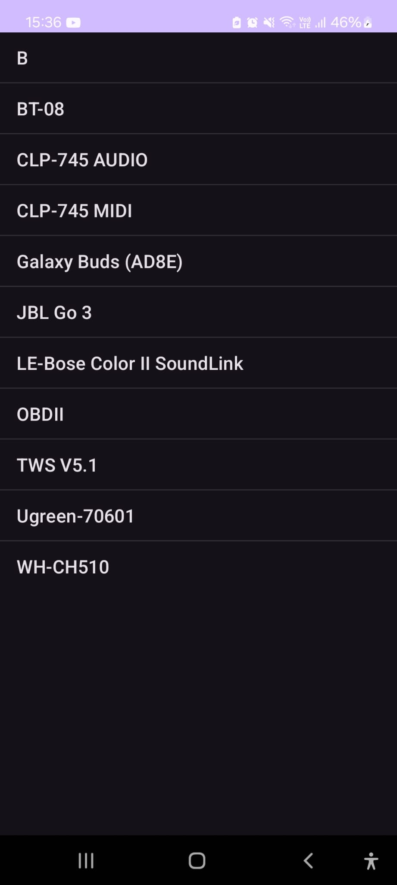
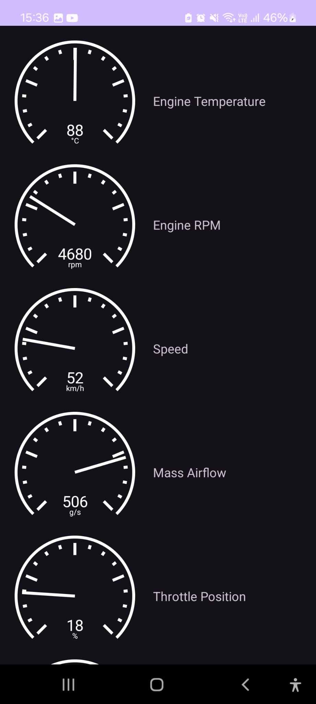

# OBD-II Android App

## Overview
This app is a simple Android-based OBD-II (On-Board Diagnostics) application designed to read vehicle data and display it in real time. The app connects to the vehicle’s OBD-II port via a Bluetooth adapter and displays key information on a customizable dashboard with a few basic gauges.

## Features
- OBD-II Connectivity: Connects to an OBD-II-compliant adapter via Bluetooth.
- Data Monitoring: Reads real-time data from the vehicle's engine control unit (ECU), such as RPM, speed and more.
- Customizable Gauges: Displays essential metrics on circular gauges.

## Usage
- Pair the mobile device with a Bluetooth OBD-II adapter (such as ELM327).
- Open the app and select the OBD-II adapter.
- Monitor Real-Time Data: Once connected, data will display on the gauges, updating as new information is received.

## Requirements
- Android 12 (API 31) or higher
- Bluetooth OBD-II adapter compatible with ELM327

## Future Improvements
- Enhanced gauge customization
- Support for additional OBD-II protocols
- Support for proprietary OBD-II PIDs
